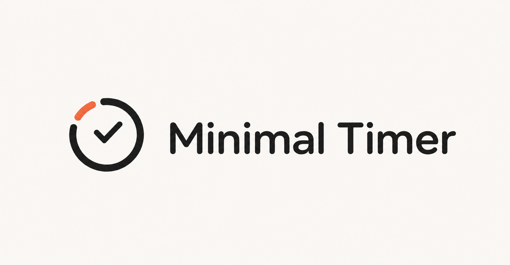

  

# Minimal Timer

**A tiny macOS menu-bar timer for doing one thing at a time.**

Minimal Timer keeps activity tracking and Pomodoro sessions pleasantly out of
your way. Name what you are doing, start the clock, and get back to it. When
you are done, finish the activity and let the app keep the total. No accounts,
no subscriptions, no surprise upgrade screen—just a small timer that lives
where you already look.

## Why it feels good to use

- **One click away.** It lives in the menu bar, not in another busy window.
- **Activities without admin.** Start “Writing,” “Email,” or “Deep work”; the
  elapsed time is visible at a glance. Switch tasks or finish when you are
  ready.
- **A Pomodoro timer that does not make a scene.** Start a focus or break
  session, see its progress, and receive a notification when it ends.
- **A little history, not a dashboard.** Review completed activities and daily
  totals when you need a reality check. Delete individual entries or clear the
  history whenever you like.
- **Your defaults, your way.** Adjust focus and break lengths, toggle
  notifications, and choose which timer details appear in the menu bar.
- **Private by default.** Activity history stays on this Mac. Nothing is sent
  anywhere.
- **Actually free.** No fees, trials, ads, or artificial limits.

## Install

1. Open the repository's **Releases** page and download the latest
   `MinimalTimer-x.y.z.zip` file.
2. Double-click the downloaded ZIP to unpack it.
3. Drag **Minimal Timer.app** into your **Applications** folder.
4. Open it from Applications. Its timer icon will appear in the menu bar—there
   is intentionally no Dock icon.

Minimal Timer requires **macOS 14 or later**. Click the menu-bar icon, name an
activity, and press **Start**. For a focus session, use the Pomodoro controls
in the same little popover.

### A quick security heads-up

Minimal Timer is ad-hoc signed but is not yet Developer ID signed and notarized
by Apple. macOS may therefore show a warning the first time you open a
downloaded release. That warning is normal for the current build—but only
continue if you downloaded the app from this repository's official Release
page and trust it.

If macOS blocks the app:

1. Try opening **Minimal Timer** once, then dismiss the warning.
2. Go to **Apple menu → System Settings → Privacy & Security**.
3. Scroll to **Security**, click **Open Anyway**, and confirm **Open**.
4. Enter your Mac login password if asked.

macOS will remember that choice for this copy of the app. For more context on
the warning, see [Apple's guidance for opening an app from an unknown
developer](https://support.apple.com/guide/mac-help/open-a-mac-app-from-an-unknown-developer-mh40616/mac).

## A small tour

| When you want to… | Do this |
| --- | --- |
| Track a task | Enter its name and choose **Start**. |
| Move to the next task | Finish the current activity, then start another. |
| Reuse something familiar | Choose it from **Start a recent one**. |
| Take a focused break from multitasking | Choose **Start Focus**. When it completes, start the suggested break (or the next focus session). |
| See where the day went | Open **History** for daily totals and completed activities. |
| Tune the timer | Open **Settings** to change durations, alerts, and menu-bar display. |

## Your data

Minimal Timer stores completed activity history locally at
`~/Library/Application Support/MinimalTimer/activity-history.sqlite`. It stays
on your Mac; clearing history from the app removes those recorded activities.

## Build a release locally

Run `./scripts/bundle-release.sh`. The versioned ZIP and its SHA-256 checksum
will be written to `dist/` using the version in `Packaging/Info.plist`.
